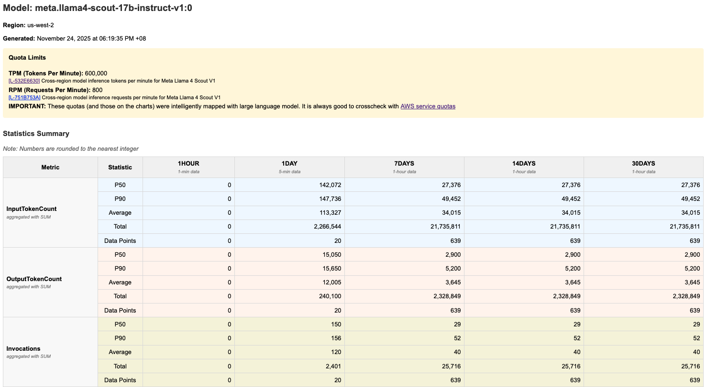
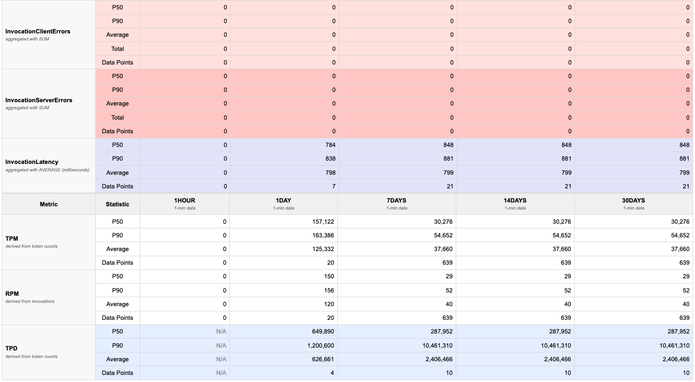
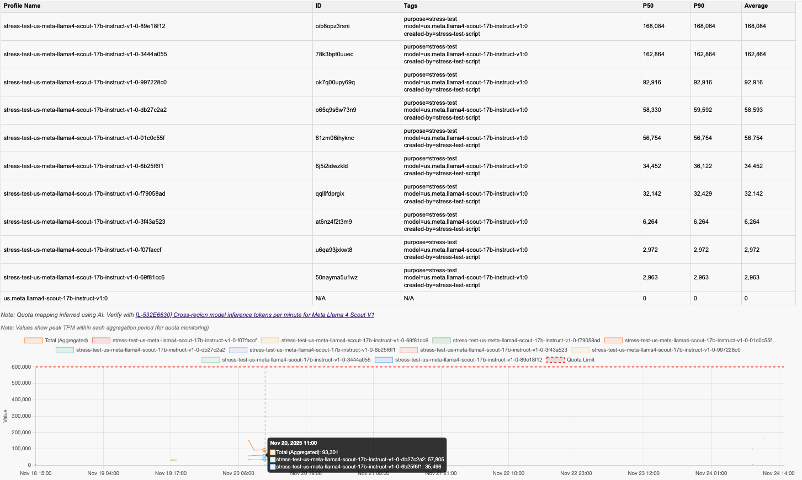

# Bedrock Token Usage Statistics Calculator

This CLI tool visualizes foundation model (FM) usage in [Amazon Bedrock](https://aws.amazon.com/bedrock/). It calculates the  tokens-per-minute/TPM and requests-per-minute/RPM. It also aggregates the FM usage across Bedrock application inference profiles and provides visibility on current usage gap towards the service quotas.

While [Amazon CloudWatch](https://aws.amazon.com/cloudwatch/) already provides metrics for the FMs used in Bedrock, it might not be straightforward to calculate TPM & RPM, to aggregate token usage across application inference profiles, and see how each profile contributes to usage. Also, the quota lookup needs to be done separately via [AWS service quotas](https://docs.aws.amazon.com/general/latest/gr/aws_service_limits.html). With this tool, you can specify the region and model to analyze and it will fetch the usage across last 1 hour, 1 day, 7 days, 14 days, and 30 days, each with aggregated data across the application inference profiles. It will generate HTML report containing the statistics table and time series data.

This CLI tool can help answers:
1. What is the usage TPM and RPM of this FM?
2. What is the total TPM across all of Bedrock application inference profiles for that model?
3. What project/application tags contribute the most to my usage of that model? (provided that you tag the application inference profile appropriately)
4. When did the throttling occur for this model and which project/application contributed the most for that?
5. How far is my current TPM against the quota?

This tool works by calling AWS APIs from your local machine, including CloudWatch [Get Metric Data](https://docs.aws.amazon.com/AmazonCloudWatch/latest/APIReference/API_GetMetricData.html) and Bedrock [List Inference Profiles](https://docs.aws.amazon.com/bedrock/latest/APIReference/API_ListInferenceProfiles.html). It then generates a JSON and HTML output file per model/system inference profile being analyzed inside `results` folder. The tool uses metadata files in `metadata` folder to obtain the list of available regions and FMs and to map each FM into the AWS service quotas L code (L-xxx). 

You can refresh the available regions, the available foundation models, and the service quotas mapping for the FMs using the scripts in `bin` folder. The FM to service quotas mapping is done intelligently with the help of foundation model called through Bedrock.

⚠️ **Important Disclaimer** This tool is currently under 0.3.0-beta version. Before using this tool in any production or critical environment, you are strongly advised to review all code thoroughly and evaluate it against best practices, security and compliance standards, and other requirements.

## Example Output

The tool generates HTML report showing token usage over time with quota limits. Please find the example screenshots in the following.





*The report includes:*
- **Quota visualization**: Red dashed lines showing TPM/RPM/TPD quotas
- **Time series charts**: Graphs for each time period that displays usage across application inference profiles for that model
- **Percentile statistics**: p50, p90, and average values in tables
- **Multiple metrics**: TPM, RPM, TPD (tokens-per-day), invocations, invocation throttles, input token count, output token count, and invocation latency.

## Prerequisites

### Required Software
- **Python** >= 3.9 with [venv](https://packaging.python.org/en/latest/guides/installing-using-pip-and-virtual-environments/)
- **AWS CLI** configured with appropriate credentials
- **GIT** to clone this repository (only needed for development install)

### AWS Account Requirements
- **Bedrock Access**: Enabled foundation models in your AWS account
- **IAM Permissions**: See detailed permission requirements below

### Network Requirements
- **Endpoint Access**: For accessing APIs from Amazon CloudWatch and Amazon Bedrock, either via the internet or via-VPC access.

### IAM Permissions

This tool requires different IAM permissions depending on which features you use:

#### Option 1: Usage Analysis Only (Lightweight)

**Use this if:** You only run `./bin/analyze-bedrock-usage` to analyze token usage.

```json
{
  "Version": "2012-10-17",
  "Statement": [
    {
      "Sid": "BedrockUsageAnalysis",
      "Effect": "Allow",
      "Action": [
        "sts:GetCallerIdentity",
        "bedrock:ListInferenceProfiles",
        "bedrock:ListTagsForResource",
        "cloudwatch:GetMetricData",
        "servicequotas:GetServiceQuota"
      ],
      "Resource": "*"
    }
  ]
}
```

**What this allows:**
- `sts:GetCallerIdentity` - Get your AWS account ID
- `bedrock:ListInferenceProfiles` - Discover inference profiles for selected models
- `bedrock:ListTagsForResource` - Retrieve tags for inference profiles (for metadata display)
- `cloudwatch:GetMetricData` - Fetch CloudWatch metrics for token usage (TPM, RPM, TPD, throttles)
- `servicequotas:GetServiceQuota` - Retrieve service quota limits for visualization

**Note:** This option assumes you already have metadata files (`metadata/fm-list-*.yml`)

#### Option 2: Full Feature Access (Complete)

**Use this if:** You run metadata refresh scripts (`./bin/refresh-*`) or test data generators. This includes **all permissions from Option 1** plus additional permissions:

Note: You need to replace some part with your own account ID and the region used.

```json
{
  "Version": "2012-10-17",
  "Statement": [
    {
      "Sid": "BedrockUsageAnalysis",
      "Effect": "Allow",
      "Action": [
        "sts:GetCallerIdentity",
        "bedrock:ListInferenceProfiles",
        "bedrock:ListTagsForResource",
        "cloudwatch:GetMetricData",
        "servicequotas:GetServiceQuota"
      ],
      "Resource": "*"
    },
    {
      "Sid": "MetadataManagement",
      "Effect": "Allow",
      "Action": [
        "account:ListRegions",
        "bedrock:ListFoundationModels",
        "servicequotas:ListServiceQuotas"
      ],
      "Resource": "*"
    },
    {
      "Sid": "QuotaMappingWithLLM",
      "Effect": "Allow",
      "Action": [
        "bedrock:InvokeModel"
      ],
      "Resource": [
        "arn:aws:bedrock:::foundation-model/anthropic.claude-*",
        "arn:aws:bedrock:YOUR_REGION_FOR_LLM_CALL::foundation-model/anthropic.claude-*",
        "arn:aws:bedrock:YOUR_REGION_FOR_LLM_CALL:YOUR_CURRENT_ACCOUNT_ID:inference-profile/*",
        "arn:aws:bedrock:YOUR_REGION_FOR_LLM_CALL:YOUR_CURRENT_ACCOUNT_ID:application-inference-profile/*"
      ]
    }
  ]
}
```

**Additional permissions explained:**
- `account:ListRegions` - List enabled AWS regions (for `bin/refresh-regions`)
- `bedrock:ListFoundationModels` - List all foundation models (for `bin/refresh-fm-list`)
- `servicequotas:ListServiceQuotas` - List all Bedrock quotas (for `bin/refresh-fm-quotas-mapping` and `bin/refresh-quota-index`)
- `bedrock:InvokeModel` - Invoke Claude models for intelligent quota mapping (for `bin/refresh-fm-quotas-mapping` only, restricted to Claude models)

#### Security Best Practices

1. **Principle of Least Privilege**: Use Option 1 if you don't need to refresh metadata
2. **Resource Restrictions**: The `bedrock:InvokeModel` permission is limited to Claude models only that is used in quota mapping
3. **No Write Permissions**: All permissions are read-only except for model invocation
4. **Region Scoping**: Consider adding `Condition` blocks to restrict to specific regions if needed

## Setup Guide

### Step 1: Clone and Set Up Environment
You can install it in three ways:

#### Option 1: Install from PyPI (Recommended)
```bash
pip install bedrock-usage-analyzer

# Run the analyzer
python -m bedrock_usage_analyzer.cli.analyze
```

#### Option 2: Editable Install (For Development)
```bash
# Clone the repository
git clone https://github.com/awslabs/bedrock-usage-analyzer.git
cd bedrock-usage-analyzer

# Install in editable mode
pip install -e .
```

#### Option 3: Using the bin scripts (Auto-setup)
```bash
# Clone the repository
git clone https://github.com/awslabs/bedrock-usage-analyzer.git
cd bedrock-usage-analyzer

# The bin scripts will automatically create venv and install
./bin/analyze-bedrock-usage

# Windows (without bash): Run Python module directly
python -m bedrock_usage_analyzer.cli.analyze
```

### Step 2: Configure AWS Credentials

Ensure your AWS CLI is configured with credentials that have the required permissions to the right AWS account. Please refer to [this documentation](https://docs.aws.amazon.com/cli/latest/userguide/cli-configure-files.html). Then performt he following command to verify.

```bash
# Verify your AWS identity
aws sts get-caller-identity
```

### Step 3: Refresh Foundation Model Lists (Optional)

Before analyzing usage, you may want to refresh the foundation model lists:

```bash
# Refresh regions list
./bin/refresh-regions
# Windows: python -m bedrock_usage_analyzer.cli.refresh regions

# Refresh foundation models for all regions
./bin/refresh-fm-list
# Windows: python -m bedrock_usage_analyzer.cli.refresh fm-list

# Or refresh for a specific region
./bin/refresh-fm-list us-west-2
# Windows: python -m bedrock_usage_analyzer.cli.refresh fm-list us-west-2
```

This step is optional because this repository comes with preloaded metadata that contains these information. However, you might want to refresh those metadata since new regions, new foundation models, or new quotas for the FMs might have come since this repository was refreshed.

### Step 4: Run Usage Analysis

```bash
# Launch the interactive usage analyzer
./bin/analyze-bedrock-usage
# Windows: python -m bedrock_usage_analyzer.cli.analyze
```

The script will prompt you to:
1. **Select AWS region** - Choose the region where you have Bedrock usage
2. **Select granularity** - Choose the time granularity to aggregate usage across (e.g. 1 min, 5 mins, 1 hour)
2. **Select model provider** - Filter by provider (Amazon, Anthropic, etc.)
3. **Select model** - Choose the specific model to analyze
4. **Select inference profile** (if applicable) - Choose base model or cross-region profile

### Step 5: View Results

After analysis completes, find your results in the `results/` directory:

```bash
# List generated reports
ls -lh results/

# Open HTML report in browser (macOS)
open results/<model-name>-<timestamp>.html

# Open HTML report in browser (Linux)
xdg-open results/<model-name>-<timestamp>.html

# View JSON data
cat results/<model-name>-<timestamp>.json | jq
```

## Understanding the Results

### HTML Report Structure

The HTML report contains several sections:

**1. Quota Limits Section** (if available)
- Shows TPM, RPM, and TPD quota limits for your model (if applicable)
- Displayed at the top for quick reference

**2. Statistics Table**
- One colum per time period (1hour, 1day, 7days, 14days, 30days)
- Columns: Metric Type, p50, p90, Average, Total, Data Points
- Metrics: TPM, RPM, TPD, InvocationThrottles, Invocations, InvocationServerErrors, InvocationClientErrors, InvocationLatency, InputTokenCount, and OutputTokenCount

**3. Charts**
- Time series graphs for each metric and time period
- **Red dashed lines**: Quota limits (when available)
- **Colored lines**: Model usage over time
- Hover over points to see exact values
- The chart can have multiple lines showing the aggregated (total) usage for that metric and the individual application inference profile usage 

### Interpreting the Data

**Token Usage Patterns:**
- **p50 (median)**: Typical usage - 50% of time periods are below this
- **p90**: High usage - only 10% of time periods exceed this
- **Average**: Mean value across all data points
- **Total**: Sum of all values in the period

**Quota Comparison:**
- If lines approach or cross red dashed quota lines, you may hit limits
- Consistent p90 near quota suggests you need a quota increase
- Large gap between p50 and quota indicates headroom
- IMPORTANT: Please cross-check the quota with ones from AWS service quotas manually, since the large language model-mapped quotas might not be always accurate.

**Throttles:**
- Any non-zero throttle count indicates you've hit rate limits
- Check which time periods show throttles to identify peak usage times

## Advanced Features

### Quota Mapping

The tool can automatically map AWS Service Quotas to foundation models:

```bash
# Run the quota mapping tool
./bin/refresh-fm-quotas-mapping
# Windows: python -m bedrock_analyzer.cli.refresh fm-quotas
```
**How it works:**
- Uses Bedrock foundation model to extract base model family names (e.g., "nova-lite" → "nova")
- Matches quota names containing model family + endpoint type
- Recognizes "on-demand", "cross-region", and "global" quota patterns
- Only makes 2-3 inference calls per model profile (on-demand, cross-region, global)
- Caches results to avoid redundant API calls

You can then validate the mapped quota. To make the validation easier, you can run the following script to create a .csv file where each row constitutes the model, endpoint, and metric combination. 

```bash
# Run the quota mapping tool
./bin/refresh-quota-index
# Windows: python -m bedrock_analyzer.cli.refresh quota-index
```

It will be saved in ./metadata/quota-index.csv. You can then validate the mapping for each row, either manually or with your AI assistant.

### Customizing Analysis

The analyzer supports various customization options through the interactive prompts:

**Model Selection:**
- Filter by provider to narrow down choices
- Select specific model variants
- Choose inference profiles (base, us, eu, jp, au, apac, global)

**Time Periods:**
- 1hour: Recent short-term patterns
- 1day: Daily patterns
- 7days: Weekly trends
- 14days: Bi-weekly patterns
- 30days: Monthly trends

## Available Scripts

### Core Analysis

**`./bin/analyze-bedrock-usage`**
- Main script for analyzing token usage
- Interactive prompts for region, provider, model selection
- Generates JSON and HTML reports in `results/` directory
- Auto-refreshes foundation model lists if needed

### Metadata Management

**`./bin/refresh-regions`**
- Fetches enabled AWS regions for your account
- Saves to `metadata/regions.yml`
- Run when you enable new regions

**`./bin/refresh-fm-list [region]`**
- Fetches foundation models and inference profiles
- Saves to `metadata/fm-list-{region}.yml`
- Run without argument to refresh all regions
- Run with region argument to refresh specific region
- Preserves existing quota mappings

**`./bin/refresh-fm-quotas-mapping`**
- Intelligently maps service quotas to foundation models
- Arguments: `[target_region] [bedrock_region] [model_id]` - all optional
- Examples:
  ```bash
  # Interactive mode - prompts for all parameters
  ./bin/refresh-fm-quotas-mapping
  
  # Skip region selection - only process us-east-1
  ./bin/refresh-fm-quotas-mapping us-east-1
  
  # Skip all prompts - process us-east-1 using us-west-2 for API calls
  ./bin/refresh-fm-quotas-mapping us-east-1 us-west-2 us.anthropic.claude-haiku-4-5-20251001-v1:0
  ```

**`./bin/refresh-quota-index`**
- Generates CSV index of all quota mappings for validation

## Troubleshooting and advanced scenarios
### Analysis Issues

**Q: "No metrics found" error**
A: This means CloudWatch has no data for the selected model. Verify:
1. The model has been used in the selected region
2. You're checking the correct time period
3. CloudWatch metrics are enabled for Bedrock

**Q: Quota limits not showing in report**
A: Quotas are only shown if they've been mapped. You can:
1. Manually edit quota mappings in `metadata/fm-list-{region}.yml`, or
2. Re-run the `./bin/refresh-fm-quotas-mapping`.

If the quota limits are still not shown, it could be that the FM is not yet listed. You can run `./bin/refresh-fm-list` before `./bin/refresh-fm-quotas-mapping`.


**Q: "Model not found" error**
A: Refresh your foundation model lists:
```bash
./bin/refresh-fm-list
# Windows: python -m bedrock_analyzer.cli.refresh fm-list
```

### Quota Mapping Issues

**Q: Quota mapping fails with "ValidationException"**
A: Ensure:
1. The selected Bedrock region supports the chosen model
2. You have access to the Claude model you selected
3. The model ID is correct (check for typos)

**Q: Some models show no quota mappings**
A: This can happen if:
1. The model is new and quotas haven't been created yet
2. The model name doesn't match quota naming patterns
3. The foundation model couldn't identify matching quotas

### Permission Issues

**Q: "AccessDenied" errors**
A: Verify your IAM permissions. See the [IAM Permissions](#iam-permissions) section for detailed permission requirements. Use:
- **Option 1** if you only run `./bin/analyze-bedrock-usage`
- **Option 2** if you also run metadata refresh scripts

### Performance Issues

**Q: Analysis is very slow**
A: CloudWatch queries can take time for large time ranges. To speed up:
1. Analyze shorter time periods
2. Use specific models instead of analyzing all models
3. Check your network connection to AWS

### Advanced scenarios

**Q: How do I swith to different AWS accounts when using this tool**
A: You can use different AWS profile as shown in the following code snippet
`AWS_PROFILE=<YOUR AWS PROFILE NAME> ./bin/analyze-bedrock-usage`

## Security Considerations

- **Credentials**: Never commit AWS credentials to the repository
- **Quota Data**: Quota information is fetched from AWS and not hardcoded
- **API Calls**: All Bedrock API calls use your AWS credentials
- **Data Storage**: All data is stored locally in `metadata/` and `results/`

## Cost Considerations
When using `./bin/analyze-bedrock-usage`, the following cost is expected:
- CloudWatch GetMetricData that is measured on the number of metrics requested
  - Refer to [CloudWatch pricing page](https://aws.amazon.com/cloudwatch/pricing/) to view the unit price per region.
  - The total cost of this component depends on the number of metrics being requested, that also depends on how many FMs are included in the query and how many times this tool is run

When FM quotas mapping (`./bin/refresh-fm-quotas-mapping`) to refresh the mapping between FM metric and the quotas, the following additional cost will apply:
- Bedrock model invocation cost that is based on the total tokens used.
  -  This is because this functionality invokes FM in Bedrock to intelligently perform the mapping. 
  -  Refer to [Bedrock pricing page](https://aws.amazon.com/bedrock/pricing/)
  -  The cost will depend on the FM chosen to perform the intelligent mapping, as well as the number of available FMs and quotas to map. One can run this functionality against only 1 region to save cost, instead of refreshing FM mapping for all regions.